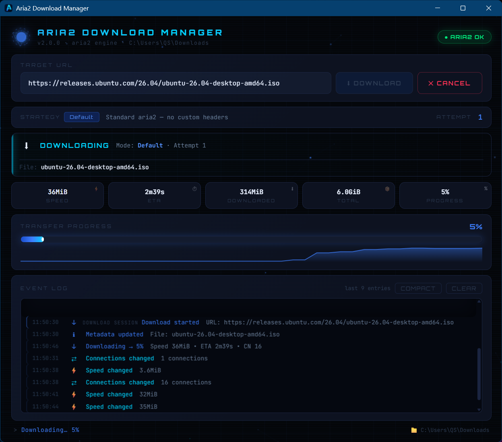

# Aria2 Download Manager


Aria2 Download Manager is a desktop download manager powered by aria2. It provides a focused Tauri interface for starting downloads, tracking progress, viewing retry status, and reading structured download events.

## Features

- aria2-powered downloads with retries and progress tracking
- Live status updates for speed, ETA, and connection changes
- Download destination detection through the system downloads directory
- Clear event log for warnings, errors, and milestones
- Simple single-window interface built with HTML, CSS, and JavaScript

## Screenshots



## Installation

- Windows: download the installer from GitHub Releases when a release is available.
- macOS: download the app or DMG bundle from GitHub Releases when available.
- Linux: download the AppImage, DEB, or RPM bundle from GitHub Releases when available.
- If no release is available, build from source using the instructions below.

## Usage

1. Launch the app.
2. Paste an HTTP, HTTPS, FTP, or FTPS download URL.
3. Start the download and monitor progress, speed, and events.
4. Stop the active download from the app if needed.

## Build From Source

Prerequisites:

- Node.js LTS
- Rust stable
- Tauri CLI v2

Quick start:

```bash
npm install
npm run tauri dev
```

Release build:

```bash
npm run tauri build
```

For platform-specific dependencies and release steps, see [BUILD.md](BUILD.md).

## Sidecar Binaries (aria2)

- Windows: this repo includes `src-tauri/bin/aria2c-x86_64-pc-windows-msvc.exe` for out-of-the-box builds.
- macOS/Linux: provide the target sidecar in `src-tauri/bin/` (the build scripts can copy a system-installed aria2c into place).

## Platform Support

- Windows 10/11
- macOS 11+
- Linux (GTK/WebKit2GTK)

## Technology Stack

- Rust 2021
- Tauri v2
- HTML/CSS/JavaScript frontend
- aria2 for download engine

## Architecture

High-level flow is documented in [docs/ARCHITECTURE.md](docs/ARCHITECTURE.md).

## Contributing

See [CONTRIBUTING.md](CONTRIBUTING.md).

## License

MIT. See [LICENSE](LICENSE).
